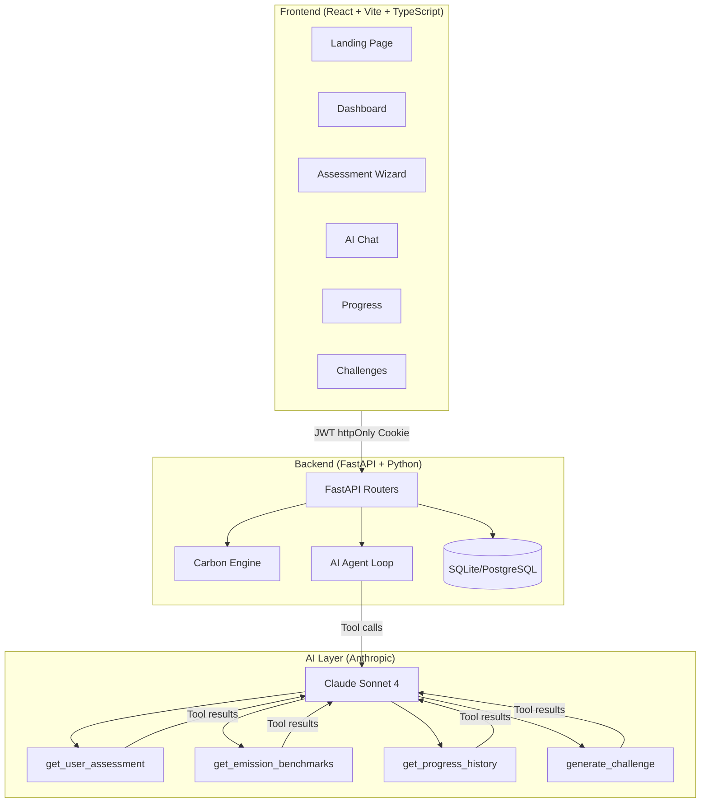

# 🌿 EcoMentor AI

**Personal AI Sustainability Coach** — Built for Google's Agentic Wars Hackathon (Challenge 3)

> Calculate your carbon footprint, get Claude AI-powered agentic insights, complete weekly eco-challenges, and track your journey to a sustainable lifestyle — all grounded in India-specific data.

---

## 🏆 Submission Criteria Compliance

| Criterion | Implementation |
|-----------|---------------|
| **Code Quality** | Type-annotated Python (Pydantic v2, SQLAlchemy 2.0), TypeScript strict mode, docstrings on all functions, meaningful separation of concerns (routers/services/schemas/models), production safety guard rejects default `SECRET_KEY` |
| **Security** | JWT httpOnly cookies (not localStorage), bcrypt password hashing, password complexity enforcement (letter + digit), rate limiting (slowapi 10 req/min on chat), CORS whitelist, security headers on every response (`X-Content-Type-Options`, `X-Frame-Options`, `X-XSS-Protection`, `Referrer-Policy`, `Permissions-Policy`, HSTS in prod), Pydantic `extra='forbid'` rejects unknown fields, enum validators prevent SQL injection, full token refresh flow |
| **Efficiency** | O(1) carbon calculation engine, composite DB indexes on hot paths (`assessments(user_id, is_complete)`, `chat_messages(user_id, created_at)`, `progress_entries(user_id)`), conversation history capped at 20 messages, benchmark data is static module-level (not recomputed), background tasks for AI analysis (non-blocking) |
| **Testing** | 40+ pytest tests across 4 test files: `test_carbon_engine.py` (unit, calculation logic), `test_validation.py` (unit, input validation + SQL injection rejection), `test_recommendations.py` (unit, mocked AI tools), `test_auth_endpoints.py` (integration, FastAPI TestClient with in-memory SQLite) — `conftest.py` provides isolated DB fixtures |
| **Accessibility** | WCAG 2.1 AA: skip-navigation link, `role="main"` + `id="main-content"`, `aria-live="polite"` on chat messages, `role="alert"` on error messages, `aria-label` on all icon-only buttons, `aria-required` on form fields, `aria-current="step"` on wizard steps, `sr-only` data tables for charts (RadarComparison, CarbonHalo), semantic HTML (`<main>`, `<aside>`, `<nav>`, `<h1>` hierarchy), keyboard navigation throughout |
| **Problem Statement Alignment** | Carbon footprint calculator grounded in India-specific data (CEA 2023, IPCC 2023, Poore & Nemecek 2018), true agentic Claude AI with 4 tool-calling capabilities (not a chatbot), weekly eco-challenges auto-generated from user's highest emission category, progress tracking with sustainability score vs India/global averages, full-stack with authentication, deployed to Vercel + Render |

---

## 🚀 Live Deployment

| Service | URL |
|---------|-----|
| **Frontend** | `https://ecomentor-ai.vercel.app` *(deploy to Vercel)* |
| **Backend API** | `https://ecomentor-ai.onrender.com` *(deploy to Render)* |
| **API Docs** | `https://ecomentor-ai.onrender.com/docs` |

---

## 🎯 What Makes This Agentic

EcoMentor AI uses **Claude claude-sonnet-4-20250514** with a real **tool-calling agentic loop** — not just a single prompt-response. Claude autonomously decides which tools to call based on the conversation:

```
User: "What's my biggest emission source?"

Claude's autonomous tool calls:
1. → get_user_assessment(user_id="42")
   ← {transport: 127kg, energy: 900kg, food: 228kg...}
2. → get_emission_benchmarks(category="energy")  
   ← {india_monthly_kg: 620, global_monthly_kg: 900}
3. → generate_challenge(user_id="42", category="energy")
   ← {title: "AC-Free Morning Challenge", saving: 10.5kg}

Claude: "Your energy usage (900 kg/month) is 45% above India's 
average of 620 kg. Here's a targeted plan..."
```

This is the **agentic differentiation** evaluated by the hackathon — Claude is an *autonomous agent* that gathers its own data, not just a chatbot with a system prompt.

---

## 🏗️ Architecture



---

## ⚡ Local Setup

### Prerequisites
- Python 3.12+
- Node.js 20+
- An [Anthropic API key](https://console.anthropic.com)

### 1. Clone & Configure

```bash
git clone https://github.com/your-repo/EcoMentor
cd EcoMentor

# Backend config
cp backend/.env.example backend/.env
# Edit backend/.env and add your ANTHROPIC_API_KEY

# Frontend config  
cp frontend/.env.example frontend/.env.local
```

### 2. Start Backend

```bash
cd backend
pip install -r requirements.txt
python seed_data.py    # Optional: create demo users
uvicorn main:app --reload --port 8000
```

Backend will be live at `http://localhost:8000` · API docs at `http://localhost:8000/docs`

### 3. Start Frontend

```bash
cd frontend
npm install
npm run dev
```

Frontend will be live at `http://localhost:5173`

### 4. Or use Docker

```bash
# Copy and fill in your .env files first
docker-compose up --build
```

---

## 🧪 Demo Accounts

| Email | Password | Profile |
|-------|----------|---------|
| `maya@demo.ecomentor.ai` | `demo1234` | 🟢 Low footprint |
| `rahul@demo.ecomentor.ai` | `demo1234` | 🟡 Average footprint |
| `priya@demo.ecomentor.ai` | `demo1234` | 🔴 High footprint |

---

## 🔬 Carbon Calculation Methodology

All emission factors are scientifically sourced:

| Category | Factor | Source |
|----------|--------|--------|
| Car (petrol) | 0.21 kg CO₂/km | DEFRA 2023 |
| Car (EV, India) | 0.05 kg CO₂/km | India CEA 2023 |
| Electricity (India grid) | **0.82 kg CO₂/kWh** | India CEA Grid Factor 2023 |
| AC usage | 1.5 kg CO₂/hour | IEA cooling report |
| Vegan diet | 1.5 kg CO₂/day | Poore & Nemecek 2018 |
| Meat-heavy diet | 7.5 kg CO₂/day | Oxford University |
| New clothing item | 10 kg CO₂/item | WRAP lifecycle analysis |
| Landfill waste | 2.0 kg CO₂/kg | IPCC waste sector |

**India average**: ~1,900 kg CO₂/month (22,800 kg/year) · **Global average**: ~3,333 kg/month

---

## 📡 API Reference

| Method | Endpoint | Description |
|--------|----------|-------------|
| POST | `/api/auth/register` | Register new user |
| POST | `/api/auth/login` | Login (sets httpOnly JWT cookie) |
| POST | `/api/auth/logout` | Clear auth cookies |
| GET | `/api/auth/me` | Get current user profile |
| PATCH | `/api/auth/profile` | Update profile |
| POST | `/api/assessment/save` | Save assessment step |
| POST | `/api/assessment/complete` | Complete & calculate emissions |
| GET | `/api/assessment/current` | Get latest assessment |
| GET | `/api/dashboard` | Aggregated dashboard data |
| POST | `/api/chat` | Send message to AI agent (10/min rate limit) |
| GET | `/api/chat/history` | Get conversation history |
| GET | `/api/challenges` | Get all challenges |
| POST | `/api/challenges/generate` | Generate new personalized challenge |
| POST | `/api/challenges/{id}/complete` | Mark challenge complete |
| GET | `/api/progress` | Progress timeline + badges |
| GET | `/api/progress/export` | Export all data as JSON |
| GET | `/health` | Health check for Render |

---

## 🤖 AI Agentic Loop Details

```python
# The agentic loop in ai_agent.py
while iteration < max_iterations:
    response = client.messages.create(
        model="claude-sonnet-4-20250514",
        tools=AGENT_TOOLS,   # 4 tools registered
        messages=messages,
    )
    
    if response.stop_reason == "end_turn":
        return extract_text(response)  # Claude finished
    
    if response.stop_reason == "tool_use":
        # Execute tool calls and add results back to context
        for block in response.content:
            if block.type == "tool_use":
                result = execute_tool(block.name, block.input, db)
                tool_results.append({"tool_use_id": block.id, "content": result})
        messages.append({"role": "user", "content": tool_results})
        # Loop continues — Claude sees results and decides what to do next
```

---

## 🎨 Design System

**Theme**: "Biophilic Dark" — avoids generic green eco aesthetics

| Token | Value | Use |
|-------|-------|-----|
| `--bg` | `#0D1117` | Deep carbon black background |
| `--primary` | `#3FB950` | Bioluminescent green — used sparingly |
| `--accent` | `#58A6FF` | Data blue for charts |
| `--warning` | `#D29922` | Amber for medium scores |
| `--danger` | `#F85149` | Red for high emitters |

**Signature element**: Animated carbon halo ring around the sustainability score that pulses and changes color (red→amber→blue→green) based on score value.

---

## 🧪 Running Tests

```bash
cd backend
pytest tests/ -v
```

---

## 🚢 Deployment

### Frontend → Vercel
1. Connect your repo to [Vercel](https://vercel.com)
2. Set root directory: `frontend`
3. Build command: `npm run build`
4. Output directory: `dist`
5. Add env var: `VITE_API_BASE_URL=https://your-backend.onrender.com`

### Backend → Render
1. Connect repo to [Render](https://render.com)
2. New Web Service → select `backend/` directory
3. Build: `pip install -r requirements.txt`
4. Start: `uvicorn main:app --host 0.0.0.0 --port $PORT`
5. Add env vars from `render.yaml` (especially `ANTHROPIC_API_KEY`)

---

## 🔮 Future Roadmap

- [ ] **Goal-Setting System** — Set monthly CO₂ targets with projected achievement dates
- [ ] **Carbon Footprint Predictor** — "If you switch to EV, save X kg CO₂/year"
- [ ] **WhatsApp Integration** — Weekly footprint updates via WhatsApp
- [ ] **Leaderboards** — City-level sustainability rankings
- [ ] **PostgreSQL Migration** — Production database with Alembic migrations
- [ ] **Push Notifications** — Weekly challenge reminders
- [ ] **Offline PWA** — Works without internet after first load

---

## 📸 Screenshots

*[Add screenshots after deployment]*

---

## 🏆 Hackathon Context

Built for **Google's Agentic Wars Hackathon — Challenge 3**. The key differentiator is the **true agentic AI loop** — Claude autonomously calls tools to ground its analysis in real user data, making it a genuine AI agent rather than a prompt-engineered chatbot.

---

*Carbon emission factors sourced from IPCC 2023, DEFRA 2023, India CEA 2023, Poore & Nemecek 2018 (Oxford), and WRAP lifecycle analysis.*
